<div align="center">


<br/>

<a href="https://readme-typing-svg.herokuapp.com">
  
</a>

<br/>

[](https://www.linkedin.com/in/mmujtaba-aztec/)
[](mailto:silenthussle.solo@gmail.com)
[](https://github.com/Mujtabanite)

</div>

---

## ⚡ `$ whoami`

```python
"""
CORE ARCHITECT: Muhammad Mujtaba
FOCUS: High-throughput Backend Systems & Multimodal AI Research
"""

class MuhammadMujtaba:
    def __init__(self):
        self.stack = {
            "backend":  ["ASP.NET Core", "C#", "SignalR", "Entity Framework"],
            "ai_ml":    ["TensorFlow", "PyTorch", "GAT", "Causal Reasoning"],
            "systems":  ["High-Concurrency (Semaphores)", "Double-Entry Ledger"],
            "data":     ["T-SQL Stored Procs", "MongoDB", "Distributed Persistence"]
        }
        self.current_obsession = "Causal Graph Attention Networks (GAT)"
        self.engineering_philosophy = "If it isn't thread-safe and audit-trailed, it isn't production."

    def execute_mission(self):
        return "Bridging the gap between raw research and bulletproof engineering."

print(MuhammadMujtaba().execute_mission())
```

---

## 🔬 Deep Tech: Multimodal Causal Research

### [Emotion–Cause Pair Extraction (ECPE)](https://github.com/Mujtabanite/Emotion-Cause-Pair-Extraction)
*Beyond Text-Only Sentiment Analysis*

Most systems fail because they ignore the **Vocal Tone** and **Visual Cues**. My research implements a temporal attention mechanism across three modalities to reason about *why* an emotion occurred, not just *what* it is.

```mermaid
graph TD
    subgraph "Modality Fusion Layer"
    T[Text Input] --> E1[RoBERTa/BERT]
    A[Audio Input] --> E2[Wav2Vec 2.0]
    V[Visual Input] --> E3[ViT/ResNet]
    end
    
    E1 & E2 & E3 --> Fusion[Utterance-Level Concatenation]
    Fusion --> TA[Temporal Attention Mechanism]
    TA --> DG[Discourse Graph: Nodes=Utterances]
    DG --> GAT[Graph Attention Network - GAT]
    GAT --> ECPE[Causal Pair Extraction]
    
    style ECPE fill:#1a4a7a,stroke:#5B9BD5,stroke-width:4px
    style TA fill:#2d1e4a,stroke:#8899bb
```



---

## 🚀 Engineering: The "Beast" Portfolio

<div align="center">

| 🖨️ High-Concurrency Portal | 🏦 Immutable Banking Ledger |
| :--- | :--- |
| **Problem:** Managing physical hardware via Web traffic.<br>**Solution:** Implemented `SemaphoreSlim` for hardware abstraction. | **Problem:** Financial data integrity at scale.<br>**Solution:** Double-entry bookkeeping enforced at schema-level. |
|   |   |
| [View Repository](https://github.com/Mujtabanite/Stationary-Photocopies-System) | [View Repository](https://github.com/Mujtabanite/Banking-Transcation-SYstem) |

| 🦖 Neuroevolution Engine | 🧠 CNN Digit Recognition |
| :--- | :--- |
| **Problem:** Training without gradients.<br>**Solution:** Genetic algorithms with tournament selection. | **Problem:** Real-time canvas inference.<br>**Solution:** ResNet-inspired CNN with data augmentation. |
|   |   |
| [View Repository](https://github.com/Mujtabanite/Dino_Game_ReinforcementLearning_JAVA) | [View Repository](https://github.com/Mujtabanite/HandWritten_Digit_Recognition_WebApp) |

</div>

---

## 🛠️ The War Chest

<div align="center">

### **Languages & Core**


### **AI & Data Science**


### **Web & Systems**


### **AI, Data & Creative**


</div>

---

## 📊 Performance Metrics

<div align="center">


<br/>


</div>

---

## 📈 Activity & Insights

<div align="center">
  
  
  <br/>
  
  
</div>

---

## 🌱 Evolution in Progress
- ⚡ **Aztec Tech:** Engineering the foundation for CS education at scale.
- 🎮 **Doc vs Virus:** Refining pathfinding and AI in Unity.
- 📖 **RAG Architectures:** Building contextual memory systems for LLMs.

---

<div align="center">

### 📬 Connect to the Network

[LinkedIn](https://www.linkedin.com/in/mmujtaba-aztec/) • [Direct Mail](mailto:silenthussle.solo@gmail.com)

*"If the code doesn't tell a story, it's just syntax."*


</div>
