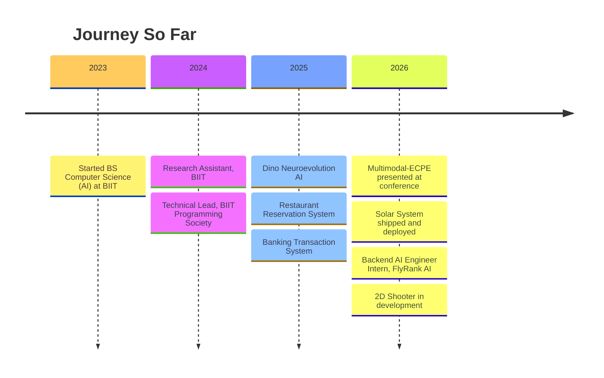

<!-- ARCADE TYPING SVG -->

 

<!-- PLAYER HUD BADGES -->

 

 

## ▸ ABOUT ME

I'm an AI engineer working across NLP, backend systems, and reinforcement learning, building toward game development. I like knowing why something works, not just that it works; that's why I built a neuroevolution engine with zero ML libraries instead of importing one, and why I'm shipping actual Unity projects instead of just reading about game development.

**What I can help with:** backend systems (APIs, databases, authentication, containerized deployment), AI/LLM integration where it genuinely solves a problem, and NLP research and implementation.

**What I'm working on right now:** a Backend AI Engineering internship at FlyRank AI, research at BIIT, and a 2D shooter game in active development.

**Outside of work:** chess, learning Japanese, and usually a book in progress.

 

## ▸ SKILLS

  

 &nbsp;
 &nbsp;

 

## ▸ GAME DEVELOPMENT

**[3D Solar System Model & Simulation](https://github.com/MujtabaNite/SolarSystem)**   

  
Playable now:  custom orbital rotation logic, a raycasting-based camera system, dynamic object spawning, cross-platform builds for Windows, macOS, and WebGL. Built in Unity 6 with the Universal Render Pipeline.  
**[▶ Play in browser](https://mujtabanite.itch.io/solarsystem-model)**

 

**[2D Shooter](https://github.com/MujtabaNite/2DShooter)**  

  
Current build. Full write-up drops once it's further along.

 

**[Dino Neuroevolution AI](https://github.com/MujtabaNite/Dino-Neuroevolution-AI)** 

  
No ML libraries: neural network inference and the full genetic algorithm cycle (selection, crossover, mutation) built by hand, evolving 100 agents to master a Chrome Dino–style game from nothing but selection pressure.

 

## ▸ AI / RESEARCH

**[Multimodal Emotion-Cause Pair Extraction](https://github.com/MujtabaNite/Multimodal-ECPE)** 

  
Goes past emotion classification to find the *cause* behind an emotion, across text and audio — RoBERTa for text, Whisper for speech-to-text, Wav2Vec2 for acoustic emotion, feeding a linguistic dependency-based cause-extraction module. Full pipeline, Flask interface, Streamlit dashboard for testing.

 

## ▸ BACKEND ENGINEERING

**[FlyRank-Work](https://github.com/MujtabaNite/FlyRank-Work)**  

  
Internship work at FlyRank AI: REST APIs, PostgreSQL persistence, JWT authentication, Docker containerization, and an LLM-integrated support-ticket endpoint, ending in a multi-tenant widget platform capstone.

 

**[Restaurant Reservation System](https://github.com/MujtabaNite/Resturant_Reservation_System)**  
  
Salted-hash authentication with account lockout, full transaction management, and a thread-safe singleton database layer for concurrent access.

 

**[Banking Transaction System](https://github.com/MujtabaNite/Banking-Transcation-SYstem)**  
  
Integrity enforced at the database level: zero inline SQL, every transaction through stored procedures, T-SQL triggers protecting the audit trail.

 

**[SQL Management Studio Clone](https://github.com/MujtabaNite/SQL-Management-Studio-Clone)**   
  
A command-line database tool from scratch in Java:  custom query parser, tokenizing and executing SQL-style statements against flat-file storage, role-based auth, JDBC error logging.

 

## ▸ TIMELINE

 

<!-- FOOTER SECTION -->

*"Loyalty is a two-way street. If I'm asking it from you, you're getting it from me."*  
 Harvey Specter

 

 

